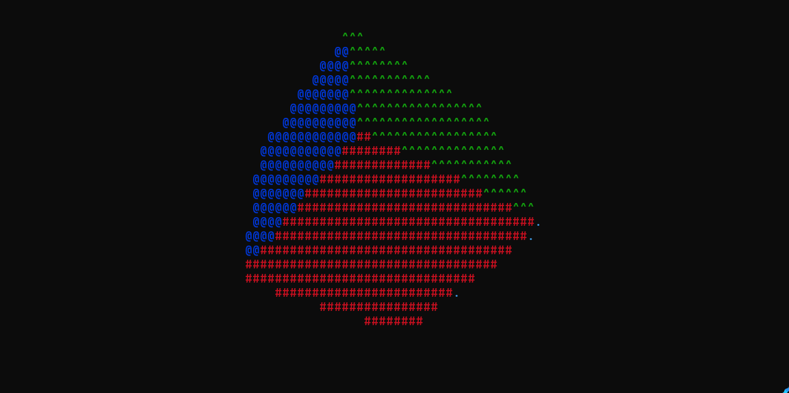

# console-3d-cube (Win32 Console)
A 3D rotating cube rendered in the windows console using ASCII characters and ANSI color codes. Implements manual 3D rotations, perspective projection, depth buffering, and frame buffering.
# Features
Manual 3D rotation (Euler angles A, B, C)

Perspective projection

Z-buffer depth testing

Frame buffering to reduce flicker

ANSI colored faces

Automatic console size detection (Win32 API)

